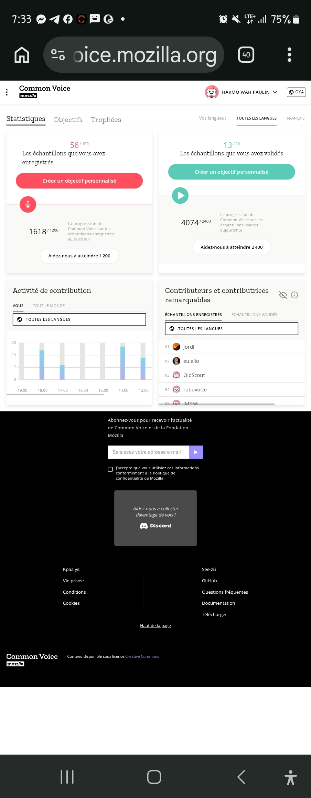

# Yaayuwee Meiganga-Garoua-Boulaï Documentation RG1173

**18 Sept 2026 - Mozilla Common Voice - Bertoua Cameroun**

**Chercheur:** HAKMO WAH PAULIN - Locuteur Yaayuwee Doforo
**Langue:** Gbaya Northwest [gya] - Dialecte Meiganga-Garoua-Boulaï
**Projet ELDP RG1173 - Manuscrit 1970-1980 - 34 lettres**

### Preuve Common Voice (ce soir)
- Profil: HAKMO WAH PAULIN
- 56/100 clips enregistrés, 13/20 validés
- Contribution mondiale: 1618/1200

### Preuve Officielle Mozilla Data Collective (filmé 18/09/2026)
- **Dataset:** Common Voice Scripted Speech 27.0 - Northwest Gbaya [gya]
- **Licence:** CC0 1.0 - Open Source
- **Taille:** 206.64 MB - 7400 clips - 9.75 heures
- **Validés:** 6914 clips - Moyenne 5.08s
- **Text corpus:** 1054 validated sentences (100% Own Submission)
- **Release Date:** 17/09/2026
- **ID Dataset:** cmu5rpu8102ynq72o3fk0t
- **Lien:** https://mozilla-common-voice-datasets.s3.dualstack.us-west-2.amazonaws.com/cv-corpus-27.0-2026-09-17/gya.tar.gz
- Exemple phrase: `Mɛ bɔli kɔli-kɔra kà gbà.`

### Objectif RG1173
1054 phrases, 6500 mots en Yaayuwee Doforo pour archivage ELAR SOAS + IA

